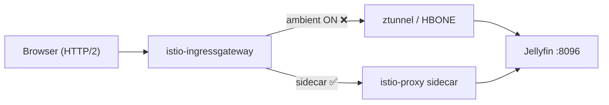

# Jellyfin Direct Play 시크 시 Ingress 마비 (Istio Ambient HBONE)

| 항목 | 내용 |
|------|------|
| **발생** | 2026-07-18 (최초), 2026-08-17 (재현·원인 확정) |
| **서비스** | Jellyfin (`jellyfin.ayteneve93.com`) |
| **스택** | `k8s-workstation-apps` (PROD) |
| **Istio** | 1.30.4, profile `ambient` |
| **상태** | **완화** — sidecar (`dataplane-mode: none` + `istio-injection: enabled`), ingress SA ALLOW. Ambient 재도입은 upstream 픽스 대기 |

---

## 증상

Direct Play(HTTPS, Ingress 경유) 중 **타임라인 시크(점프)** 시:

1. `GET /Videos/.../stream.{mp4,mkv}?Static=true` → HTTP **206** 후 `http2.remote_reset`
2. 이후 Ingress HTTPS 전체 마비 (`/health`, UI, API) — **8~10초 타임아웃**
3. Jellyfin Pod 내부 `localhost:8096/health` → **항상 200** (앱·스토리지 정상)
4. `istio-ingressgateway` 재시작 전까지 복구되지 않음

### 정상 케이스

- 시크 **없이** 연속 재생 → 수백 MB 끝까지 OK
- `kubectl port-forward svc/jellyfin 8096:8096` → 시크 포함 **정상**
- Pod 재시작·**다른 미디어 파일**(mp4/mkv) → **동일 증상** (파일 문제 아님)

### Ingress access log 패턴 (장애 시)

```
upstream: envoy://connect_originate/<pod-ip>:8096
flags: DR http2.remote_reset
```

### Ingress access log 패턴 (mesh 제외 완화 후)

```
upstream: <pod-ip>:8096   # connect_originate / HBONE 없음
```

---

## 원인

**Jellyfin 앱·미디어 파일·Helm이 아니라, Istio Ambient dataplane + Ingress Gateway 조합의 알려진 버그.**

| 레이어 | 해당 여부 |
|--------|-----------|
| Jellyfin / Longhorn / 파일 | ❌ |
| Ingress Gateway HTTP/2 단독 | △ (트리거 역할) |
| **Ambient HBONE `connect_originate` stream leak** | ✅ **근본 원인** |

Gateway가 ambient in-mesh destination(Jellyfin namespace `dataplane-mode: ambient`)으로 트래픽을 보낼 때, 클라이언트가 **대용량 Range 응답(206) 중간에 연결을 끊는 경우**(영상 시크) upstream HBONE CONNECT stream이 정리되지 않고 누적된다. 일정 횟수 후 Gateway upstream cluster가 wedged 되며, Jellyfin뿐 아니라 같은 Gateway 경로의 HTTPS 요청 전체가 막힌다.

> Istio maintainer: ambient 전체 문제가 아니라 **Gateway 경유 + HBONE + mid-stream abort** 조합의 Envoy 버그.  
> ([istio/istio#60074](https://github.com/istio/istio/issues/60074) 코멘트)

Envoy 픽스 [envoyproxy/envoy#45198](https://github.com/envoyproxy/envoy/pull/45198)은 이슈 완료 시점(2026-09-06) 기준 **미머지**. Istio 1.30.4 `proxyv2`에도 없음. Ambient 경로로는 해결 불가.

### 조사 중 배제된 가설

| 시도 | 결과 |
|------|------|
| DestinationRule HTTP/1.1 강제 | ❌ |
| VirtualService `/Videos/` route 분리 | ❌ |
| downstream HTTP/1.1 EnvoyFilter | ❌ (Gateway SNI 와일드카드) |
| TLS passthrough + nginx sidecar | ❌ |
| bandwidth limit EnvoyFilter | ❌ (악화 요인일 수 있으나 baseline에서도 재현) |
| VirtualService-only baseline (mesh 정책 제거) | ❌ **ambient ON 상태에서 동일** |

---

## 조치

### 1. Sidecar + Gateway SA only (2026-09-06) — 채택

Ambient 재도입은 Envoy 픽스 전까지 불가. Sidecar로 mTLS·Authz를 복원하고 HBONE `connect_originate`를 피했다.

```yaml
# jellyfin Namespace
metadata:
  labels:
    istio-injection: enabled
```

- Gateway → sidecar ISTIO_MUTUAL. HBONE/`connect_originate` 없음.
- `PeerAuthentication` STRICT.
- `AuthorizationPolicy` ALLOW only `cluster.local/ns/istio-system/sa/istio-ingressgateway`.
- Direct gateway SFTP도 같은 ingressgateway SA.

### 2. 이전 완화 (2026-08-17): mesh 완전 제외

```yaml
# jellyfin Namespace
metadata:
  labels:
    istio.io/dataplane-mode: none
```

- Ingress → Jellyfin 평문. VirtualService만 유지.
- PeerAuthentication / AuthorizationPolicy 제거 (sidecar 재도입 전까지).

### 3. 코드 반영 위치

| 파일 | 변경 |
|------|------|
| `infra/k8s-workstation-apps/src/components/jellyfin/jellyfin.helm-chart.component.ts` | `istio-injection: enabled` |
| `infra/k8s-workstation-apps/src/components/jellyfin/jellyfin.service-mesh.component.ts` | VirtualService + PeerAuthentication STRICT + Authz ingress SA |
| `infra/k8s-workstation-apps/src/contract.ts` | `serviceAccounts.istioIngressGateway` 전달 |

### 4. 장애 시 임시 복구 (sidecar 이전)

```bash
kubectl rollout restart deploy/istio-ingressgateway -n istio-system
```

---

## 검증 (2026-09-06)

클러스터:

- Pod `3/3 Ready` (`jellyfin` + `sftp-sidecar` + native `istio-proxy` 1.30.4).
- `https://jellyfin.ayteneve93.com/health` → 200 `Healthy`. `/web/` → 200.
- Pod 내부 `127.0.0.1:8096/health` → 200.
- ClusterIP·Pod IP plaintext → `Connection reset by peer` (STRICT + Authz).

사용자: Direct Play 시크 재현, Ingress 마비 없음.

---

## 추후: Ambient 모드 재활성화

Jellyfin을 다시 `istio.io/dataplane-mode: ambient`로 올리려면 아래가 끝난 뒤 **이 이슈에서** 검증한다.

- [envoyproxy/envoy#45198](https://github.com/envoyproxy/envoy/pull/45198) 머지 및 사용 중 Istio `proxyv2` 포함
- [istio/istio#60074](https://github.com/istio/istio/issues/60074) 클로즈
- Direct Play + 시크 스트레스 (mp4/mkv, 연속 시크 10회+)
- Gateway `rq_active` vs `cx_active` 1:1 고착 여부

그때 PeerAuthentication / AuthorizationPolicy는 유지하고 sidecar injection만 제거하면 된다.

---

## 관련 이슈·링크

### 핵심 (동일 증상 · Jellyfin repro)

| 링크 | 설명 |
|------|------|
| [istio/istio#60074](https://github.com/istio/istio/issues/60074) | **Ambient gateway wedges under client-aborted Range requests** — Jellyfin + 시크 repro, `connect_originate` stream leak |
| [envoyproxy/envoy#45198](https://github.com/envoyproxy/envoy/pull/45198) | HBONE stream teardown fix (upstream, Istio proxy 반영 대기) |
| [evan-hines-js/istio-hbone-wedge-repro](https://github.com/evan-hines-js/istio-hbone-wedge-repro) | 공식 repro 저장소 (Jellyfin + Big Buck Bunny / stream.mp4) |

### 동일 계열 (장시간·대용량·클라이언트 abort)

| 링크 | 설명 |
|------|------|
| [istio/ztunnel#1945](https://github.com/istio/ztunnel/issues/1945) | SSE/장시간 스트림 + 클라이언트 disconnect → backpressure / stuck |
| [istio/ztunnel#1637](https://github.com/istio/ztunnel/issues/1637) | HBONE half-open → 503 `connection_termination` |
| [istio/istio#60767](https://github.com/istio/istio/issues/60767) | Gateway + ambient → 간헐 503 UC (`connect_originate`) |
| [envoyproxy/envoy#44983](https://github.com/envoyproxy/envoy/pull/44983) | CONNECT tunnel upstream reset 전파 (관련 시리즈) |

### 문서

| 링크 | 설명 |
|------|------|
| [Istio Ambient data plane](https://istio.io/latest/docs/ambient/architecture/data-plane/) | ztunnel / waypoint / HBONE 개요 |
| [Istio Ambient performance (2025)](https://istio.io/latest/blog/2025/ambient-performance/) | ambient 일반 성능 (이번 버그와 별개) |
| [Namespace dataplane-mode 제거](https://istio.io/latest/docs/ambient/getting-started/cleanup/) | `istio.io/dataplane-mode-` 라벨 제거 방법 |

### 내부 맥락

| 링크 | 설명 |
|------|------|
| `.specstory/history/2026-07-18_16-05-20Z-jellyfin-service-outage-logs.md` | 7/18 최초 장애 (헤일메리 Direct Play, WAN 포화 가설, bandwidth limit 도입 배경) |

---

## 참고: 트래픽 경로



---

## 타임라인 (요약)

| 일시 | 내용 |
|------|------|
| 2026-07-18 | Direct Play 중단 → Ingress 마비 (헤일메리). bandwidth limit EnvoyFilter 도입 |
| 2026-08-17 | 재현. mesh 튜닝(1·2·B·C) 및 VS-only baseline 실패 |
| 2026-08-17 | **`dataplane-mode: none`** → 즉시 정상. mp4/mkv 무관 확인 |
| 2026-08-17 | 코드 정리 (VirtualService only). istio#60074와 1:1 매칭 확인 |
| 2026-09-06 | sidecar + PeerAuthentication STRICT + Authz ingress SA 배포 |
| 2026-09-06 | Direct Play 시크 정상 확인. 이슈 완료. `docs/issues/` → `docs/resolved/` 아카이브 |
| 2026-09-06 | 완화·upstream 대기로 `docs/resolved/` → `docs/issues/` 복원 |
